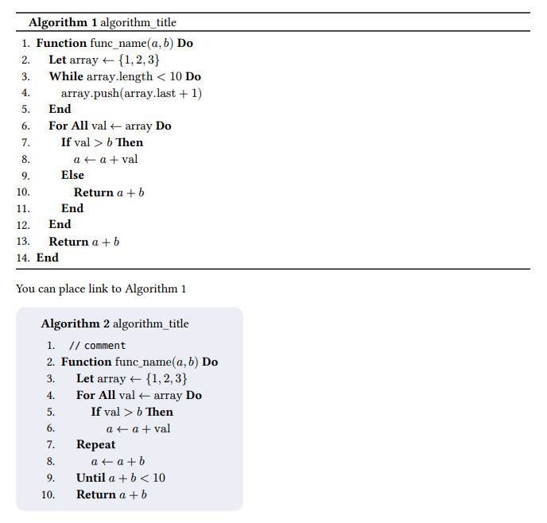

# Algorithm for Typst

inspired by [typst-theorems](https://github.com/sahasatvik/typst-theorems).

## Example

```typ
#import "../algomod.typ": algomod, algomodLink
#import "../algomod_statements.typ": *

#let algorithm = algomod()

#algorithm(
  title: [algorithm_title],
  label: <label>,
  lines: (
    Function("func_name", $a, b$),
      Let($"array" <- {1, 2, 3}$),
      While($"array.length" < 10$),
        $"array.push"("array.last" + 1)$,
      End(),
      ForAll("val", "array"),
        If($"val" > b$),
          $a <- a + "val"$,
        Else(),
          Return($a + b$),
        End(),
      End(),
      Return($a + b$),
    End(),
  )
)

You can place link to #algomodLink(<label>)

#let customedAlgorithm = algomod(
  // Change indent size
  indentSize: 1.2em,
  // Change format
  format: (title, lines) => [
    #block(
      fill: rgb("#EBEEF5"),
      radius: 8pt,
      pad(
        x: 2em,
        y: 1em,
      )[
        #title
        #v(.4em)
        #enum(..lines)
      ]
    )
  ]
)

// Customize statement
// preIndent: make indent in the current line
// postIndent: make indent in the next line
#let Comment(comment) = {
  return createStatement(
    preIndent: 0.5,
    postIndent: -0.5,
    [`//` #raw(comment)],
  )
}

// Override default statement
// You can (de)indent w/o displaying any lines like this
#let End() = {
  return createStatement(
    preIndent: -1,
    none,
  )
}

#customedAlgorithm(title: [algorithm_title], lines: (
  Comment("comment"),
  Function($"func_name"$, $a, b$),
    Let($"array" <- {1, 2, 3}$),
    ForAll($"val"$, $"array"$),
      If($"val" > b$),
        $a <- a + "val"$,
      End(),
    End(),
    Repeat(),
      $a <- a + b$,
    Until($a + b < 10$),
    Return($a + b$),
  End(),
))
```


